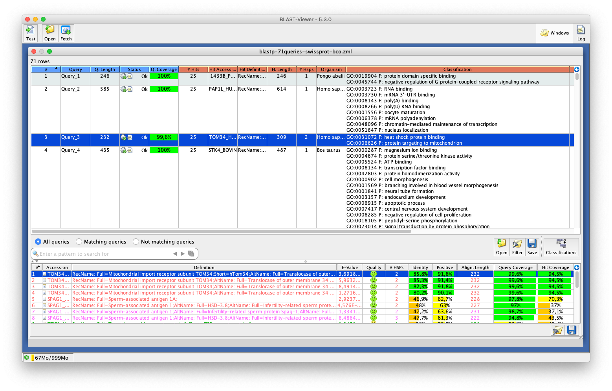

# BlastViewer

  

## Introduction

This is the BlastViewer Tool. It aims at displaying in a graphical way results from the NCBI BLAST software.

Starting with release 5.5.0, BlastViewer is now capable of importing and displaying [InterProScan](https://interproscan-docs.readthedocs.io/en/latest/) predictions:

## Requirements

Use a [Java Virtual Machine](http://www.oracle.com/technetwork/java/javase/downloads/index.html) 1.8+ from Oracle.  

*Not tested with any other JVM providers but Oracle... so there is no guarantee that the software will work as expected if not using Oracle's JVM.*

## User manual

See the [Wiki](https://github.com/pgdurand/BlastViewer/wiki) page of this project.

## License and dependencies

BlastViewer itself is released under the GNU Affero General Public License, Version 3.0. [AGPL](https://www.gnu.org/licenses/agpl-3.0.txt)

It depends on several thrid-party libraries as stated in the NOTICE.txt file provided with this project.

## Once upon a time was: VisualBlast / KoriBlast / ngKLAST

During Summer 2004 I was asking myself how easy it could be to rewrite in Java the original [VisualBlast software](http://www.ncbi.nlm.nih.gov/pubmed/9283755) written in C for the MS-Windows platform.

Actually, the answer was quite immediate: it took me a few days to fully rewrite Visual Blast, thanks to the many libraries available, mostly from Sun MicroSystems and the Apache Software Foundation.

So, during my holidays on Summer 2004, I started a wonderful story: the creation of what would eventually become the [KoriBlast/ngKLAST suite of softwares](http://plealog.com/korilog/product-sheets/ngKLAST.pdf), the founding software of my company, Korilog.

Korilog ceased its activities on June 2015, therefore I decided to release these UI components to the open source community... just in time for Christmas 2016! ;-) 

--
(c) 2003-2020 - Patrick G. Durand
